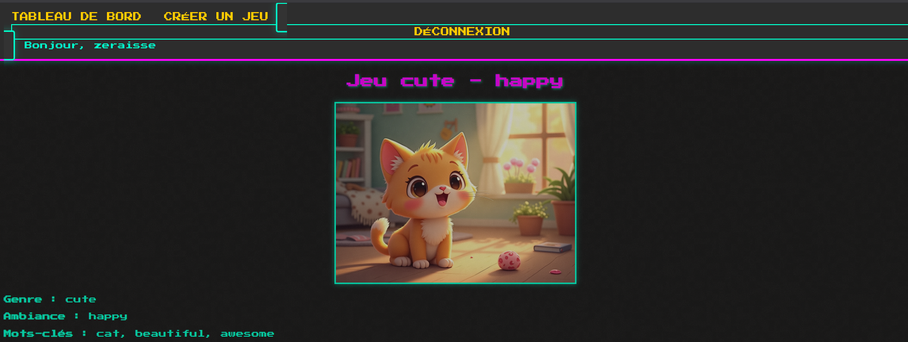

# Game Scenario Generator




## Description
This project is a Django-based application designed to generate game scenarios. It leverages the power of Django and MySQL to provide a robust and scalable solution for creating dynamic game scenarios.

## Features
- Generate custom game scenarios.
- Built with Django, a high-level Python web framework.
- Uses MySQL as the database backend.

## Prerequisites
- Python 3.x
- Django
- MySQL

## Installation
1. Clone the repository:
    ```bash
    git clone <repository-url>
    cd gameGenerator
    ```

### **Fast Auto Install (optional)**

On **Linux or macOS**, you can do the following:

```bash
chmod +x setup_unix.sh
./setup_unix.sh
```

On **Windows**, you can either double-click on **`setup_win.bat`** or run it in a **Command Prompt**:

```cmd
cd \Your\folder\path\gameGenerator
setup_win.bat
```

2. Create a virtual environment and activate it:
    ```bash
    python -m venv venv
    source venv/bin/activate  # On Windows: venv\Scripts\activate
    ```

3. Install dependencies:
    ```bash
    pip install -r requirements.txt
    ```

4. Configure the `.env` file:
    Create a `.env` file in the root directory with the following structure:
    ```
    HUGGINGFACE_API_KEY=
    DB_PASSWORD=
    DB_USER=
    DB_HOST=
    DB_PORT=
    DB_NAME=
    HUGGINGFACE_API_URL=
    ```

5. Apply migrations:
    ```bash
    python manage.py migrate
    ```
## Populate BDD

1. You can populate part of the DB by using the script:
    ```bash
    python populateWords.py
    ```

## Running the Application in Development Mode

1. Start the development server:
    ```bash
    python manage.py runserver
    ```

2. Access the application in your browser at `http://127.0.0.1:8000`.

## Testing
This project is currently in the testing phase. Feel free to explore and provide feedback.

## Technologies Used
- **Django**: High-level Python web framework.
- **MySQL**: Relational database management system.

## License
This project is licensed under the MIT License.

## Contributing
Contributions are welcome! Feel free to open issues or submit pull requests.